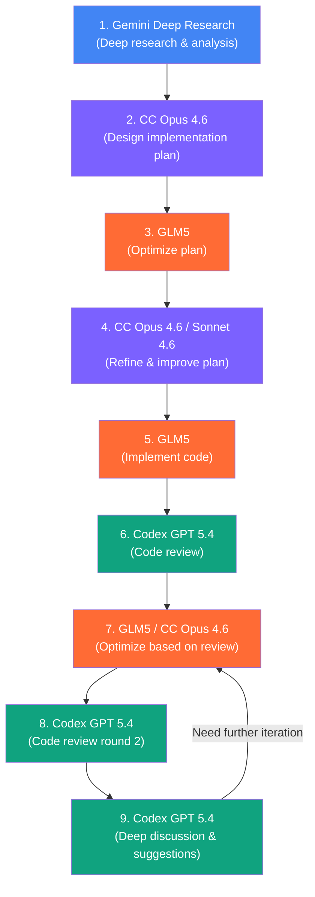
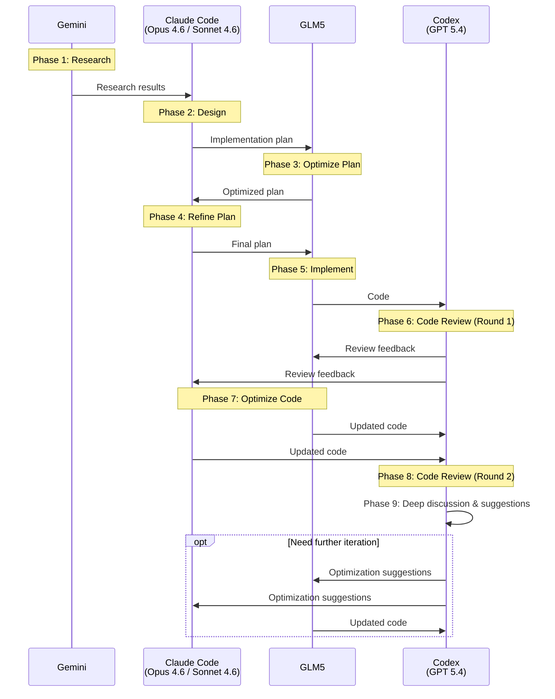

# Development Process

Multi-model collaborative development workflow.

## Flow Diagram

## Sequence Diagram

## Role Summary

| Model | Role |
|-------|------|
| **Gemini** | Deep research & background analysis |
| **Claude Code (Opus 4.6 / Sonnet 4.6)** | Architecture design, plan refinement, code optimization |
| **GLM5** | Plan optimization, primary code implementation, code optimization |
| **Codex (GPT 5.4)** | Code review, deep discussion, quality assurance |
